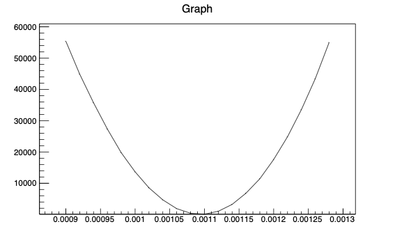
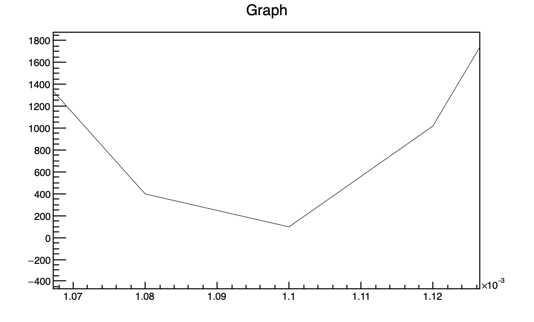
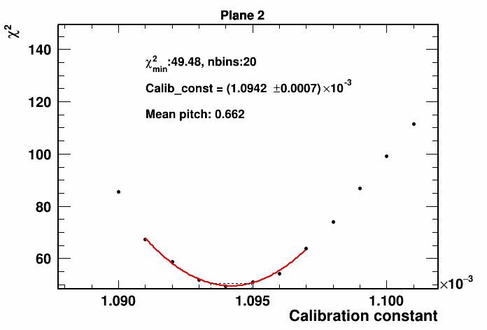

# Instruction to run ProtoDUNE-SP Calibration Codes
## Login to dunegpvm
I will login to dunegpvm08 for this instruction.
```
$ ssh -Y <user_name>@dunegpvm08.fnal.gov
```

## Setup an area
Then, move to your app directory.
```
$ cd /dune/app/users/<user_name>
```
Make a directory for protodune calibration codes.
```
$ mkdir ProtoDUNE
$ cd ProtoDUNE
$ mkdir calib
$ cd calib
```
We will use dunesw version `v09_49_00d00 -q e20:prof`.
First,
```
$ source /cvmfs/dune.opensciencegrid.org/products/dune/setup_dune.sh
```
Then, make an dunesw area
```
$ mrb newDev -v v09_49_00d00 -q e20:prof
```
You will see messages like bellow.
```
building development area for larsoft v09_49_00d00 -q e20:prof


The following configuration is defined:
  The top level directory is .
  The source code directory will be under .
  The build directory will be under .
  The local product directory will be under .

MRB_BUILDDIR is /dune/app/users/<user_name>/ProtoDUNE/calib/build_slf7.x86_64
MRB_SOURCE is /dune/app/users/<user_name>/ProtoDUNE/calib/srcs 
INFO: cannot find larsoft/v09_49_00d00/releaseDB/base_dependency_database
      or larsoftcode/v09_49_00d00/releaseDB/base_dependency_database
      mrb checkDeps and pullDeps will not have complete information

IMPORTANT: You must type
    source /dune/app/users/<user_name>/ProtoDUNE/calib/localProducts_larsoft_v09_49_00d00_e20_prof/setup
NOW and whenever you log in
```
Then,
```
$ source localProducts_larsoft_v09_49_00d00_e20_prof/setup 
```
You will see messages like
```
MRB_PROJECT=larsoft
MRB_PROJECT_VERSION=v09_49_00d00
MRB_QUALS=e20:prof
MRB_TOP=/dune/app/users/<user_name>/ProtoDUNE/calib
MRB_SOURCE=/dune/app/users/<user_name>/ProtoDUNE/calib/srcs
MRB_BUILDDIR=/dune/app/users/<user_name>/ProtoDUNE/calib/build_slf7.x86_64
MRB_INSTALL=/dune/app/users/<user_name>/ProtoDUNE/calib/localProducts_larsoft_v09_49_00d00_e20_prof

PRODUCTS=/dune/app/users/<user_name>/ProtoDUNE/calib/localProducts_larsoft_v09_49_00d00_e20_prof:/cvmfs/dune.opensciencegrid.org/products/dune:/cvmfs/larsoft.opensciencegrid.org/products:/cvmfs/larsoft.opensciencegrid.org/packages:/cvmfs/fermilab.opensciencegrid.org/products/common/db/
CETPKG_INSTALL=/dune/app/users/<user_name>/ProtoDUNE/calib/localProducts_larsoft_v09_49_00d00_e20_prof
```
Let's copy "protoduneana"
```
$ mrb g protoduneana
```
You will see messages like
```
Cloning into 'protoduneana'...
X11 forwarding request failed on channel 0
remote: Enumerating objects: 8516, done.
remote: Counting objects: 100% (597/597), done.
remote: Compressing objects: 100% (208/208), done.
remote: Total 8516 (delta 434), reused 508 (delta 389), pack-reused 7919
Receiving objects: 100% (8516/8516), 2.99 MiB | 16.45 MiB/s, done.
Resolving deltas: 100% (6403/6403), done.
Updating files: 100% (487/487), done.
NOTICE: Adding protoduneana to CMakeLists.txt file
```
Let's synchronize protoduneana's version with the dunssw
```
$ cd src/protoduneana
$ git tag
```
You will see a list of tags.
```
$ git checkout v09_49_00d00
```
You will see message like
```
Note: switching to 'v09_49_00d00'.

You are in 'detached HEAD' state. You can look around, make experimental
changes and commit them, and you can discard any commits you make in this
state without impacting any branches by switching back to a branch.

If you want to create a new branch to retain commits you create, you may
do so (now or later) by using -c with the switch command. Example:

  git switch -c <new-branch-name>

Or undo this operation with:

  git switch -

Turn off this advice by setting config variable advice.detachedHead to false

HEAD is now at 831b48f Merge branch 'release/v09_49_00d00'
```
Then,
```
$ git checkout -b v09_49_00d00
```
If you check the branc, you should see
```
$ git branch -vv
  develop      d97577d [origin/develop] Merge tag 'v09_75_00d00' into develop
* v09_49_00d00 831b48f Merge branch 'release/v09_49_00d00'
```
Let's build the area
```
$ cd ../
$ mrbsetenv
```
You will see message like
```
The working build directory is /dune/app/users/<user_name>/ProtoDUNE/calib/build_slf7.x86_64
The source code directory is /dune/app/users/<user_name>/ProtoDUNE/calib/srcs
----------- check this block for errors -----------------------
INFO: mrb v6_08_00 requires cetmodules >= 2.31.00 to run: attempting to configure...v3_21_01 OK
----------------------------------------------------------------
To inspect build variable settings, execute /dune/app/users/<user_name>/ProtoDUNE/calib/build_slf7.x86_64/cetpkg_info.sh

Please use "buildtool" (or "mrb b") to configure and build MRB project "larsoft", e.g.:

  buildtool -vTl [-jN]

See "buildtool --usage" (short usage help) or "buildtool -h|--help"
(full help) for more details.
```
Then, you can build the area,
```
$ mrb i -j4
```
You should see the following message after building the area.
```
------------------------------------
INFO: stage install SUCCESS for MRB project larsoft v09_49_00d00
------------------------------------
```

## Run
Please note that you can use these commands to run codes in the area for next login's
```
$ cd /dune/app/users/


/ProtoDUNE/calib
$ source /cvmfs/dune.opensciencegrid.org/products/dune/setup_dune.sh
$ setup dunesw v09_49_00d00 -q e20:prof
$ source /dune/app/users/<user_name>/ProtoDUNE/larsoft/localProducts_larsoft_v09_49_00d00_e20_prof/setup
$ mrbslp
$ mrbsetenv
```

Let's assume that you are on `/dune/app/users/<user_name>/ProtoDUNE/calib`. Go to the directory where we have codes for calibration
```
$ cd srcs/protoduneana/protoduneana/singlephase/michelremoving/
```
Make a txt file named as `input_run5387.txt` with contents.
```
root://fndca1.fnal.gov:1094/pnfs/fnal.gov/usr/dune/tape_backed/dunepro/protodune-sp/root-tuple/2020/detector/physics/PDSPProd4/00/00/53/87/np04_run005387_PDSPProd4_michelremoving_merged_0_200.root
root://fndca1.fnal.gov:1094/pnfs/fnal.gov/usr/dune/tape_backed/dunepro/protodune-sp/root-tuple/2020/detector/physics/PDSPProd4/00/00/53/87/np04_run005387_PDSPProd4_michelremoving_merged_200_400.root
root://fndca1.fnal.gov:1094/pnfs/fnal.gov/usr/dune/tape_backed/dunepro/protodune-sp/root-tuple/2020/detector/physics/PDSPProd4/00/00/53/87/np04_run005387_PDSPProd4_michelremoving_merged_400_600.root
root://fndca1.fnal.gov:1094/pnfs/fnal.gov/usr/dune/tape_backed/dunepro/protodune-sp/root-tuple/2020/detector/physics/PDSPProd4/00/00/53/87/np04_run005387_PDSPProd4_michelremoving_merged_600_800.root
root://fndca1.fnal.gov:1094/pnfs/fnal.gov/usr/dune/tape_backed/dunepro/protodune-sp/root-tuple/2020/detector/physics/PDSPProd4/00/00/53/87/np04_run005387_PDSPProd4_michelremoving_merged_800_950.root
```
Note that the ProtoDUNE-SP's Run5387 is used as general reference for Run1 calibration.
Get a valid access to those root files using commands bellow (I recommand make a .sh file in your home direcoty with those commands for your convenience).
```
$ kx509
$ export EXPERIMENT=dune
$ export ROLE=Analysis
$ voms-proxy-init -rfc -noregen -voms dune:/dune/Role=$ROLE -valid 24:00
```

### Uniformity correction : YZ correction
Run the code at `/dune/app/users/<user_name>/ProtoDUNE/calib/srcs/protoduneana/protoduneana/singlephase/michelremoving/`.
```
$ make_yz_correction input_run5387.txt 2
```
It will take several minutes with messages like
```
2
michelremoving2/Event
Plugin version SecClnt v5.1.0 is incompatible with secztn v5.5.3 (must be <= 5.1.x) in sec.protocol libXrdSecztn-5.so
Process Run 5387
0/122143
10000/122143
20000/122143
30000/122143
40000/122143
50000/122143
60000/122143
70000/122143
80000/122143
90000/122143
100000/122143
110000/122143
120000/122143
*************** Calculating the local median dQ/dx values for each Y-Z cell ******************
********************** Calculating fractional dQ/dx corrections for each Y-Z cell ********************
******************** Calculating corrected dQ/dx value for each Y-Z cell **********************
********************** Calculating fractional dQ/dx corrections for each Y-Z cell ********************
******************** Calculating corrected dQ/dx value for each Y-Z cell **********************
********************** Calculating fractional dQ/dx corrections for each Y-Z cell ********************
******************** Calculating corrected dQ/dx value for each Y-Z cell **********************
Info in <TCanvas::MakeDefCanvas>:  created default TCanvas with name c1
crossing tracks 147931
*************** Y_Z_Correction_make_class.C macro has ended ******************
```
Then, you will have a new file (`YZcalo_mich2_r5387.root`)in the directory.
```
-bash-4.2$ ls -lht
total 384K
-rw-r--r-- 1 sungbino dune 1009K May 30 10:39 YZcalo_mich2_r5387.root
-rw-r--r-- 1 sungbino dune   993 May 30 10:31 input_run5387.txt
.
.
.
```

### Uniformity correction : X correction
Before running, we should modify/check codes for several values.
Open `./Xcalo/protoDUNE_X_calib.C`, and modify
- Line 29 : modify/checkthe liquid argon density value
- Line 30 - 31 : modify/check the modified box model parameters
Then, build the area again,
```
$ mrb i -j4
```
Let's run at `/dune/app/users/<user_name>/ProtoDUNE/calib/srcs/protoduneana/protoduneana/singlephase/michelremoving/`,
```
$ make_x_correction input_run5387.txt 2 1
```
It will take several minute with messages bellow.
```
michelremoving2/Event
SCE on
efield at the anode neg0.432389
efield at the anode pos0.449398
Plugin version SecClnt v5.1.0 is incompatible with secztn v5.5.3 (must be <= 5.1.x) in sec.protocol libXrdSecztn-5.so
0/122143
10000/122143
20000/122143
30000/122143
40000/122143
50000/122143
60000/122143
70000/122143
80000/122143
90000/122143
100000/122143
110000/122143
120000/122143
*************** Calculating the local median dQ/dx values for each Y-Z cell ******************
**************** Calculating fractional correction for each x cell *********************
**************** Calculating XYZ corrected dQ/dx values ********************
**************** Calculating fractional correction for each x cell *********************
**************** Calculating XYZ corrected dQ/dx values ********************
**************** Calculating fractional correction for each x cell *********************
**************** Calculating XYZ corrected dQ/dx values ********************
Info in <TCanvas::MakeDefCanvas>:  created default TCanvas with name c1
*************** X_Correction_make_class.C macro has ended ******************
```
with several new files,
```
-bash-4.2$ ls -lht
total 1.5M
-rw-r--r-- 1 sungbino dune    13 May 30 10:56 global_median_0_r5387.txt
-rw-r--r-- 1 sungbino dune    13 May 30 10:56 global_median_1_r5387.txt
-rw-r--r-- 1 sungbino dune    13 May 30 10:56 global_median_2_r5387.txt
-rw-r--r-- 1 sungbino dune  5.9K May 30 10:56 globalmedians_cathanode_r5387.root
-rw-r--r-- 1 sungbino dune   17K May 30 10:56 Xcalo_mich2_r5387.root
.
.
.
```
We will use contents in `global_median_*_r5387.txt` files for the calibration constant measurement.

### dE/dx calibration - measuring the calibration constant
We should modify some codes.
First, open the `./dEdX/protoDUNE_dEdx_calib.C`,
- Line 55 : modify/check the LAr density
- Line 374 : modify/check the LAr density
- Line 377 - 378 : modify/check the modified box model parameters
Then, build the area again,
```
$ mrb i -j4
```
Then, modify the `./dEdX/protoDUNE_dEdx_calib.fcl`.
- Line 5 - 6 : Modify directory to `/dune/app/users/<user_name>/ProtoDUNE/calib/srcs/protoduneana/protoduneana/singlephase/michelremoving/`, as well as run number to 5387. For example,
```
YZCaloFile: "/dune/app/users/<user_name>/ProtoDUNE/calib/srcs/protoduneana/protoduneana/singlephase/michelremoving/YZcalo_mich2_r5387.root"
XCaloFile:  "/dune/app/users/<user_name>/ProtoDUNE/calib/srcs/protoduneana/protoduneana/singlephase/michelremoving/Xcalo_mich2_r5387.root"
```
- Line 9 - 11 : Modify numbers to second numbers in `global_median_*_r5387.txt` files. For example,
```
NormFactors: [
66.7543,
64.7201,
60.0065
]
```
- Line 34 - 44 : These lines define ranges and steps to scan for calibration constant values. We will calculate chi2 based on comparisons between Vavilov MPVs and Laudau+Gaussain convoluted functions' MPVs of stopped muons' dE/dx disributions. A calibration constant with the mininum chi2 will be the measured calibration constant for a plane. So, it is good to start with a wide range with big step size to look for a region with the minimum chi2. Then, we can zoom into that region to measure calibration constants with better accuracy. Let's start with 0.02e-03 step size in the range of 0.900e-3 to 1.300e-3.
```
Plane0Start: 0.990e-3
Plane0End: 1.030e-3
Plane0Diff: .001e-3

Plane1Start: 1.025e-3
Plane1End: 1.026e-3
Plane1Diff: .001e-3

Plane2Start: 1.011e-3
Plane2End: 1.012e-3
Plane2Diff: .001e-3
```
To run,
```
$ dEdX_calibration -i input_run5387.txt -c dEdX/protoDUNE_dEdx_calib.fcl -o output.root
```
It will take several minutes and make a new file `output.root`.
You can check chi2 shape inside the `output.root`.
```
$ root -l output.root 
new TBrroot [0] 
Attaching file output.root as _file0...
root [1] .ls
TFile**		output.root	
 TFile*		output.root	
  KEY: TGraph	chi2_plane_0;1	Graph
  KEY: TGraph	chi2_plane_1;1	Graph
  KEY: TGraph	chi2_plane_2;1	Graph
  .
  .
  .
```
Check chi2_plane_* TGraph objects and check where are minimum points.
Using those numbers, scan calibration constatns with smaller step (0.001e-3) and narrower (0.020e-3) range.
For example, the bellow figures show a minimum value near 1.100e-3. So, we can scan in 1.109e-3 to 1.110e-3 range with 0.001e-3 step.




After modifying the `./dEdx/protoDUNE_dEdx_calib.fcl` with narrower range and step size, we should run the code once more.
```
$ dEdX_calibration -i input_run5387.txt -c dEdX/protoDUNE_dEdx_calib.fcl -o output.root
```

To extract calibration constant for each plane, modify `./scripts/calconst.C`.
- Line 63, change to 
```
gr[i]->Fit("pol2","RQ","",bestx-0.003e-3, bestx+0.003e-3);
```
- Line 72 - 73 : modify to
```
double x1 = C0-(C0-C1)*10;                                                                                                                                                                      
double x2 = C0+(C0-C1)*10;
```
Then, build the area again,
```
$ mrb i -j4
```
Then, run
```
$ calculate_calibration_constants output.root
```
You will see messages with measured calibration constants like
```
OBJ: TStyle	protoDUNEStyle	ProtoDUNE Style : 0 at: 0x45e2500
Plane 0
Minimal chi2 32.9853
Calibration constant 0.00123128+-1.10254e-06
Info in <TCanvas::Print>: png file calconst_0.png has been created
Info in <TCanvas::Print>: pdf file calconst_0.pdf has been created
Plane 1
Minimal chi2 46.921
Calibration constant 0.0011845+-9.95166e-07
Info in <TCanvas::Print>: png file calconst_1.png has been created
Info in <TCanvas::Print>: pdf file calconst_1.pdf has been created
Plane 2
Minimal chi2 49.4794
Calibration constant 0.0010942+-7.47859e-07
Info in <TCanvas::Print>: png file calconst_2.png has been created
Info in <TCanvas::Print>: pdf file calconst_2.pdf has been created
```
and new files with chi2 shapes and fitting results with 2nd order polynomial.
```
-bash-4.2$ ls -lht
total 4.7M
-rw-r--r-- 1 sungbino dune    22 May 30 16:05 calconst_2.txt
-rw-r--r-- 1 sungbino dune   15K May 30 16:05 calconst_2.pdf
-rw-r--r-- 1 sungbino dune   13K May 30 16:05 calconst_2.png
-rw-r--r-- 1 sungbino dune    22 May 30 16:05 calconst_1.txt
-rw-r--r-- 1 sungbino dune   15K May 30 16:05 calconst_1.pdf
-rw-r--r-- 1 sungbino dune   13K May 30 16:05 calconst_1.png
-rw-r--r-- 1 sungbino dune    23 May 30 16:05 calconst_0.txt
-rw-r--r-- 1 sungbino dune   16K May 30 16:05 calconst_0.pdf
-rw-r--r-- 1 sungbino dune   14K May 30 16:05 calconst_0.png
```
You can check if chi2 shape is reasonable. Here is an example.

